# ERD Compify — Entity Relationship Diagram

Dibuat: 05 June 2026  
Referensi: Models Laravel + Dokumentasi Flowchart Compify

---

## Cara Baca

- `PK` = Primary Key  
- `FK` = Foreign Key  
- `||--o{` = one-to-many  
- `||--||` = one-to-one  
- `}o--||` = many-to-one  
- `o|--o{` = optional one-to-many  

---

## ERD Lengkap

```mermaid
erDiagram

    %% ─────────────────────────────────────────────
    %% CORE USER
    %% ─────────────────────────────────────────────

    users {
        bigint id PK
        string name
        string username
        string email
        string google_id
        string provider
        string avatar
        string password
        enum role "admin | customer"
        string phone
        text address
        string city
        string province
        string postal_code
        enum gender
        date birth_date
        timestamp email_verified_at
        timestamp created_at
        timestamp updated_at
    }

    %% ─────────────────────────────────────────────
    %% CATALOG
    %% ─────────────────────────────────────────────

    categories {
        bigint id PK
        bigint parent_id FK "nullable, self-ref"
        string name
        string slug
        string image
        text description
        boolean is_active
        integer sort_order
        timestamp created_at
        timestamp updated_at
    }

    brands {
        bigint id PK
        string name
        string slug
        string logo
        string website_url
        boolean is_active
        integer sort_order
        timestamp created_at
        timestamp updated_at
    }

    products {
        bigint id PK
        bigint category_id FK
        bigint brand_id FK
        string sku
        string name
        string slug
        text description
        decimal price
        decimal sale_price "nullable"
        integer stock
        string image
        boolean is_featured
        boolean is_new
        boolean is_active
        integer sort_order
        datetime sale_starts_at "nullable"
        datetime sale_ends_at "nullable"
        timestamp created_at
        timestamp updated_at
    }

    %% ─────────────────────────────────────────────
    %% PAYMENT & SHIPPING
    %% ─────────────────────────────────────────────

    payment_methods {
        bigint id PK
        string name
        string slug
        enum type "whatsapp | qr | url | api"
        string logo
        string qr_image "nullable"
        string payment_url "nullable"
        string whatsapp_number "nullable"
        text whatsapp_template "nullable"
        boolean auto_redirect
        string api_provider "nullable"
        string api_endpoint "nullable"
        text instructions "nullable"
        boolean is_active
        integer sort_order
        timestamp created_at
        timestamp updated_at
    }

    shipping_methods {
        bigint id PK
        string name
        string code
        text description
        integer base_cost
        integer same_district_cost
        integer same_city_cost
        integer same_province_cost
        integer outside_province_cost
        integer free_shipping_min
        string estimate
        boolean is_active
        integer sort_order
        timestamp created_at
        timestamp updated_at
    }

    shipping_settings {
        bigint id PK
        string country
        string province
        string city
        string district
        string postal_code
        timestamp created_at
        timestamp updated_at
    }

    %% ─────────────────────────────────────────────
    %% ORDERS
    %% ─────────────────────────────────────────────

    orders {
        bigint id PK
        bigint user_id FK
        bigint shipping_method_id FK
        bigint payment_method_id FK
        string order_number
        string customer_name
        string customer_email
        string customer_phone
        text shipping_address
        string shipping_province
        string shipping_city
        string shipping_district
        string shipping_postal_code
        decimal subtotal
        decimal shipping_cost
        decimal discount_amount
        decimal total_amount
        enum payment_status "pending | paid | settlement | capture | failed | expired | refunded"
        enum order_status "pending | processing | shipped | completed | cancelled"
        string payment_type "nullable"
        string payment_reference "nullable"
        string payment_redirect_url "nullable"
        decimal universal_discount_eligible_subtotal "nullable"
        decimal universal_discount_amount "nullable"
        decimal universal_discount_percent "nullable"
        string universal_discount_label "nullable"
        string universal_discount_campaign_key "nullable"
        json universal_discount_snapshot "nullable"
        timestamp created_at
        timestamp updated_at
    }

    order_items {
        bigint id PK
        bigint order_id FK
        enum item_type "product | event_flash_sale | combo_package"
        bigint product_id FK "nullable"
        bigint combo_package_id FK "nullable"
        bigint event_flash_sale_item_id FK "nullable"
        string product_name
        string product_slug
        string product_image
        decimal price
        decimal original_price
        decimal discount_amount
        string price_label
        integer quantity
        decimal total
        json snapshot_data "nullable"
        timestamp created_at
        timestamp updated_at
    }

    %% ─────────────────────────────────────────────
    %% EVENT
    %% ─────────────────────────────────────────────

    event_settings {
        bigint id PK
        string title
        string subtitle
        boolean is_active
        datetime starts_at "nullable"
        datetime ends_at "nullable"
        boolean show_hero_section
        boolean show_flash_sale_section
        boolean show_full_banner_section
        boolean show_combo_package_section
        enum universal_discount_mode "off | event_only | always"
        enum universal_discount_scope
        datetime universal_discount_starts_at "nullable"
        datetime universal_discount_ends_at "nullable"
        integer universal_discount_batch
        string universal_discount_campaign_key "nullable"
        timestamp created_at
        timestamp updated_at
    }

    event_hero_images {
        bigint id PK
        enum position "main | side_top | side_bottom"
        string title "nullable"
        string subtitle "nullable"
        string image
        string link_url "nullable"
        boolean is_active
        integer sort_order
        timestamp created_at
        timestamp updated_at
    }

    event_flash_sale_groups {
        bigint id PK
        string name
        boolean is_active
        integer sort_order
        timestamp created_at
        timestamp updated_at
    }

    event_flash_sale_items {
        bigint id PK
        bigint event_flash_sale_group_id FK
        bigint product_id FK
        enum discount_type "percent | amount"
        decimal discount_value
        integer stock_limit "nullable"
        boolean is_active
        integer sort_order
        timestamp created_at
        timestamp updated_at
    }

    event_full_banners {
        bigint id PK
        string title "nullable"
        string subtitle "nullable"
        text description "nullable"
        string image
        string button_text "nullable"
        string button_url "nullable"
        boolean is_active
        integer sort_order
        timestamp created_at
        timestamp updated_at
    }

    %% ─────────────────────────────────────────────
    %% COMBO PACKAGE
    %% ─────────────────────────────────────────────

    combo_packages {
        bigint id PK
        string name
        string slug
        string subtitle "nullable"
        text description "nullable"
        decimal package_price
        enum discount_type "percent | amount"
        decimal discount_value
        string image "nullable"
        boolean is_active
        integer sort_order
        timestamp created_at
        timestamp updated_at
    }

    combo_package_items {
        bigint id PK
        bigint combo_package_id FK
        bigint product_id FK
        integer quantity
        integer sort_order
        timestamp created_at
        timestamp updated_at
    }

    %% ─────────────────────────────────────────────
    %% UNIVERSAL DISCOUNT
    %% ─────────────────────────────────────────────

    universal_discount_tiers {
        bigint id PK
        bigint event_setting_id FK
        decimal min_purchase
        decimal discount_percent
        boolean is_active
        integer sort_order
        timestamp created_at
        timestamp updated_at
    }

    universal_discount_usages {
        bigint id PK
        bigint user_id FK
        bigint order_id FK
        string campaign_key
        decimal eligible_subtotal
        decimal discount_percent
        decimal discount_amount
        datetime used_at
        timestamp created_at
        timestamp updated_at
    }

    %% ─────────────────────────────────────────────
    %% HOME LAYOUT
    %% ─────────────────────────────────────────────

    home_layout_groups {
        bigint id PK
        string name
        boolean is_active
        timestamp created_at
        timestamp updated_at
    }

    home_layout_slots {
        bigint id PK
        bigint home_layout_group_id FK
        integer slot_number
        enum slot_type "none | product_display | full_banner | split_banner | gallery"
        enum product_source "category | best_seller | latest"
        bigint category_id FK "nullable"
        bigint home_section_id FK "nullable"
        string title "nullable"
        string subtitle "nullable"
        boolean is_active
        timestamp created_at
        timestamp updated_at
    }

    home_sections {
        bigint id PK
        string section_type
        string display_style
        string title "nullable"
        string subtitle "nullable"
        string image "nullable"
        string button_text "nullable"
        string button_url "nullable"
        boolean is_active
        integer sort_order
        timestamp created_at
        timestamp updated_at
    }

    home_category_grid_settings {
        bigint id PK
        string title
        string subtitle
        integer columns_desktop
        integer columns_tablet
        integer columns_mobile
        boolean is_active
        timestamp created_at
        timestamp updated_at
    }

    home_category_grid_items {
        bigint id PK
        bigint category_id FK
        string custom_name "nullable"
        string image "nullable"
        boolean is_active
        integer sort_order
        timestamp created_at
        timestamp updated_at
    }

    %% ─────────────────────────────────────────────
    %% CONTENT / BANNER
    %% ─────────────────────────────────────────────

    banners {
        bigint id PK
        string title
        string subtitle "nullable"
        string button_text "nullable"
        string button_url "nullable"
        string image "nullable"
        string video "nullable"
        enum asset_type "image | video"
        boolean is_active
        integer sort_order
        timestamp created_at
        timestamp updated_at
    }

    about_sections {
        bigint id PK
        string section_key
        text content
        string image "nullable"
        boolean is_active
        timestamp created_at
        timestamp updated_at
    }

    %% ─────────────────────────────────────────────
    %% FONNTE
    %% ─────────────────────────────────────────────

    fonnte_settings {
        bigint id PK
        boolean is_active
        string api_url
        string token "encrypted"
        string admin_phone "nullable"
        boolean send_customer_order_created
        boolean send_admin_order_created
        text customer_order_created_template
        text admin_order_created_template
        timestamp created_at
        timestamp updated_at
    }

    fonnte_message_logs {
        bigint id PK
        bigint order_id FK
        string event_type
        string target
        enum status "success | failed"
        text message
        json response_data "nullable"
        text error_message "nullable"
        datetime sent_at "nullable"
        timestamp created_at
        timestamp updated_at
    }

    %% ─────────────────────────────────────────────
    %% CUSTOMER / NEWSLETTER
    %% ─────────────────────────────────────────────

    newsletter_subscribers {
        bigint id PK
        string email
        bigint customer_id FK "nullable"
        string source
        string ip_address "nullable"
        string user_agent "nullable"
        datetime subscribed_at
        timestamp created_at
        timestamp updated_at
    }

    %% ─────────────────────────────────────────────
    %% SETTINGS
    %% ─────────────────────────────────────────────

    shop_settings {
        bigint id PK
        string site_name
        string support_email
        string support_phone
        string login_heading "nullable"
        string login_subheading "nullable"
        string login_showcase_title "nullable"
        string login_showcase_text "nullable"
        string login_image "nullable"
        timestamp created_at
        timestamp updated_at
    }

    %% ═════════════════════════════════════════════
    %% RELASI
    %% ═════════════════════════════════════════════

    %% Catalog
    categories ||--o{ categories : "parent → children"
    categories ||--o{ products : "has many"
    brands ||--o{ products : "has many"

    %% Orders
    users ||--o{ orders : "has many"
    payment_methods ||--o{ orders : "has many"
    shipping_methods ||--o{ orders : "has many"
    orders ||--o{ order_items : "has many"
    products ||--o{ order_items : "referenced in"
    combo_packages ||--o{ order_items : "referenced in"
    event_flash_sale_items ||--o{ order_items : "referenced in"

    %% Event Flash Sale
    event_flash_sale_groups ||--o{ event_flash_sale_items : "has many"
    products ||--o{ event_flash_sale_items : "has many"

    %% Combo Package
    combo_packages ||--o{ combo_package_items : "has many"
    products ||--o{ combo_package_items : "has many"

    %% Universal Discount
    event_settings ||--o{ universal_discount_tiers : "has many"
    users ||--o{ universal_discount_usages : "has many"
    orders ||--o{ universal_discount_usages : "has many"

    %% Home Layout
    home_layout_groups ||--o{ home_layout_slots : "has many"
    categories ||--o{ home_layout_slots : "optional ref"
    home_sections ||--o{ home_layout_slots : "optional ref"
    categories ||--o{ home_category_grid_items : "has many"

    %% Fonnte
    orders ||--o{ fonnte_message_logs : "has many"

    %% Newsletter
    users ||--o{ newsletter_subscribers : "optional customer"
```

---

## Ringkasan Relasi Utama

| Dari | Ke | Tipe | Keterangan |
|------|----|------|------------|
| `users` | `orders` | 1-N | Satu customer bisa punya banyak order |
| `categories` | `categories` | 1-N | Self-referential parent–child |
| `categories` | `products` | 1-N | Satu kategori punya banyak produk |
| `brands` | `products` | 1-N | Satu brand punya banyak produk |
| `orders` | `order_items` | 1-N | Satu order punya banyak item |
| `payment_methods` | `orders` | 1-N | Satu payment method dipakai banyak order |
| `shipping_methods` | `orders` | 1-N | Satu shipping method dipakai banyak order |
| `event_flash_sale_groups` | `event_flash_sale_items` | 1-N | Grup flash sale punya banyak item |
| `products` | `event_flash_sale_items` | 1-N | Produk bisa masuk banyak flash sale |
| `combo_packages` | `combo_package_items` | 1-N | Satu paket combo punya banyak item produk |
| `event_settings` | `universal_discount_tiers` | 1-N | Tier diskon milik satu event |
| `orders` | `universal_discount_usages` | 1-N | Satu order bisa punya riwayat diskon |
| `home_layout_groups` | `home_layout_slots` | 1-N | Satu group layout punya banyak slot |
| `orders` | `fonnte_message_logs` | 1-N | Satu order bisa punya banyak log notif |
| `users` | `newsletter_subscribers` | 1-N | Customer opsional terdaftar newsletter |

---

## Catatan Teknis

- **`order_items.item_type`** menentukan kolom FK mana yang aktif: `product_id`, `combo_package_id`, atau `event_flash_sale_item_id`. Kolom yang tidak aktif bernilai `NULL`.
- **`order_items.snapshot_data`** menyimpan JSON children produk untuk combo package, dipakai saat restore stok saat order dihapus.
- **`categories.parent_id`** adalah self-referential FK — kategori bisa bersarang dua level.
- **`fonnte_settings.token`** disimpan encrypted di database (Laravel `encrypted` cast).
- **`event_settings`** hanya satu baris (singleton), diakses via `EventSetting::current()`.
- **`home_layout_groups`** hanya satu yang `is_active = true` di satu waktu.
- **`universal_discount_usages`** melacak penggunaan diskon per user per kampanye untuk mencegah double claim.
