# Dokumentasi Flowchart Lengkap Project Compify

Dibuat: 05 June 2026 03:42

## Daftar Isi
1. [Ringkasan Sistem](#ringkasan-sistem)
2. [Flow Utama dari User Masuk Website](#flow-utama-dari-user-masuk-website)
3. [Flow Auth Admin dan Customer](#flow-auth-admin-dan-customer)
4. [Flow Shop Layout](#flow-shop-layout)
5. [Flow Admin Layout dan Sidebar](#flow-admin-layout-dan-sidebar)
6. [Flow Home Page dan Home Layout](#flow-home-page-dan-home-layout)
7. [Flow Produk, Kategori, Search, dan Brand](#flow-produk-kategori-search-dan-brand)
8. [Flow Product Pricing dan Flash Sale Price](#flow-product-pricing-dan-flash-sale-price)
9. [Flow Stok Flash Sale dan Limit Pembelian](#flow-stok-flash-sale-dan-limit-pembelian)
10. [Flow Wishlist](#flow-wishlist)
11. [Flow Cart Produk dan Paket Kombo](#flow-cart-produk-dan-paket-kombo)
12. [Flow Checkout sampai Order Created](#flow-checkout-sampai-order-created)
13. [Flow Payment Branch: WhatsApp, Midtrans, Manual](#flow-payment-branch-whatsapp-midtrans-manual)
14. [Flow Fonnte Notification](#flow-fonnte-notification)
15. [Flow Payment Page](#flow-payment-page)
16. [Flow Admin Orders dan Restore Stock](#flow-admin-orders-dan-restore-stock)
17. [Flow Event Frontend](#flow-event-frontend)
18. [Flow Admin Event Management](#flow-admin-event-management)
19. [Flow Combo Package Detail dan Cart](#flow-combo-package-detail-dan-cart)
20. [Flow Admin Dashboard Data](#flow-admin-dashboard-data)
21. [Flow Newsletter](#flow-newsletter)
22. [Flow Database / ERD Ringkas](#flow-database-erd-ringkas)
23. [Flow Migrations / Modul Database](#flow-migrations-modul-database)
24. [Full Flow Pembelian dari Awal sampai Akhir](#full-flow-pembelian-dari-awal-sampai-akhir)
25. [Known Gaps / Hal yang Perlu Dicek Lagi](#known-gaps-hal-yang-perlu-dicek-lagi)

## 1. Ringkasan Sistem

Dokumen ini merangkum flow project Compify dari awal sampai akhir: akses shop, auth admin/customer, home layout, product pricing, event, cart, checkout, payment, Fonnte, order management, dashboard admin, sampai relasi database.

Format utama flowchart menggunakan Mermaid. File Markdown dapat langsung dibuka di editor yang mendukung Mermaid seperti GitHub, VS Code dengan ekstensi Mermaid, atau Mermaid Live Editor. File DOCX disediakan sebagai dokumentasi baca dan arsip, dengan kode Mermaid tetap dicantumkan agar mudah diedit.

Catatan akurasi: dokumen ini dibuat dari file project yang dikirim: auth.php, Middleware, Models, Services, migrations, admin views, shop views, dan layout admin/shop.

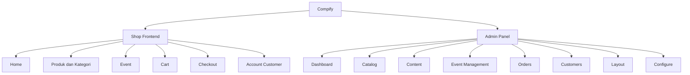

Catatan:
- Shop frontend dipakai guest/customer untuk melihat produk, event, cart, checkout, dan akun.
- Admin panel dipakai admin untuk mengatur data produk, event, order, layout home, payment, shipping, Fonnte, dan customer.
- Guard auth admin dan customer sama-sama memakai provider users, tetapi akses dipisahkan lewat guard dan role.

## 2. Flow Utama dari User Masuk Website

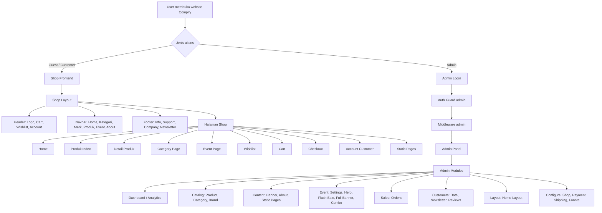

## 3. Flow Auth Admin dan Customer

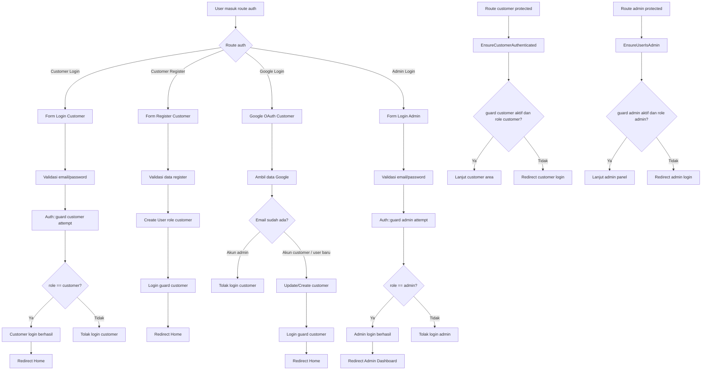

Catatan:
- Admin dan customer tetap bisa dipisah walaupun memakai tabel users yang sama.
- Kunci keamanan ada pada guard yang benar dan role check yang ketat.
- Customer login/register diarahkan ke Home, bukan intended admin URL.

## 4. Flow Shop Layout

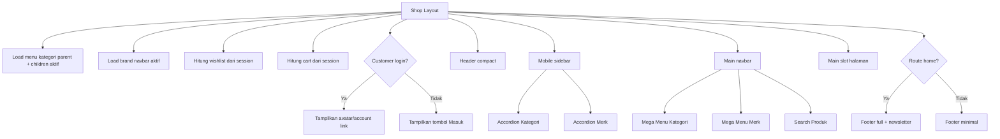

## 5. Flow Admin Layout dan Sidebar

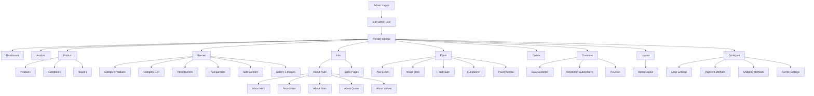

## 6. Flow Home Page dan Home Layout

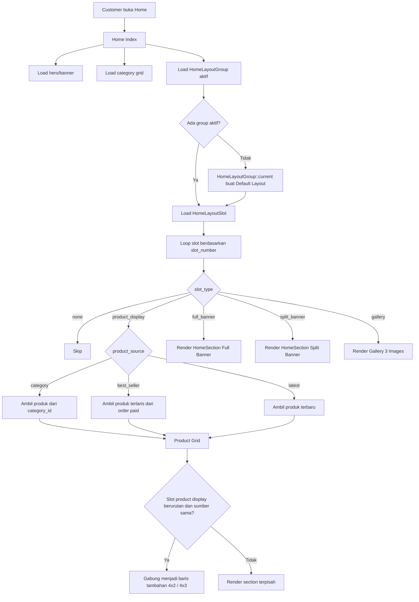

Catatan:
- Default layout yang disarankan: Best Seller, Latest Product, Full Banner, Motherboard 2x, RAM, Monitor.
- Group baru dibuat kosong agar admin bisa mengatur dari awal tanpa menimpa default layout.

## 7. Flow Produk, Kategori, Search, dan Brand

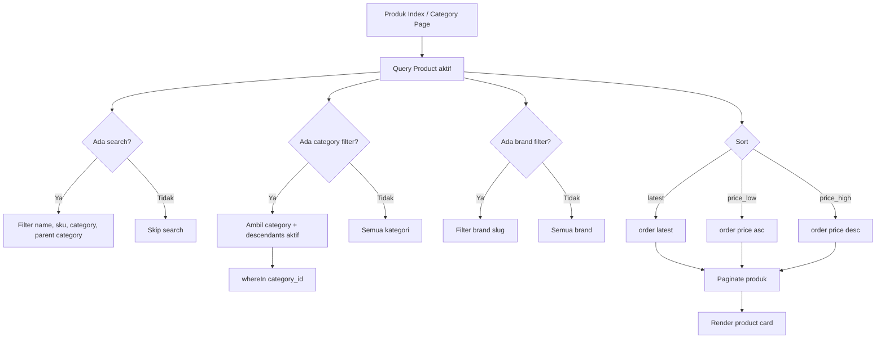

## 8. Flow Product Pricing dan Flash Sale Price

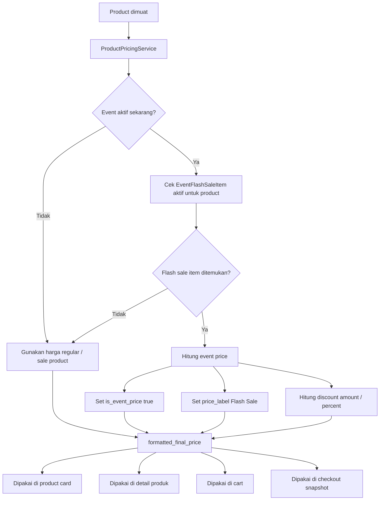

## 9. Flow Stok Flash Sale dan Limit Pembelian

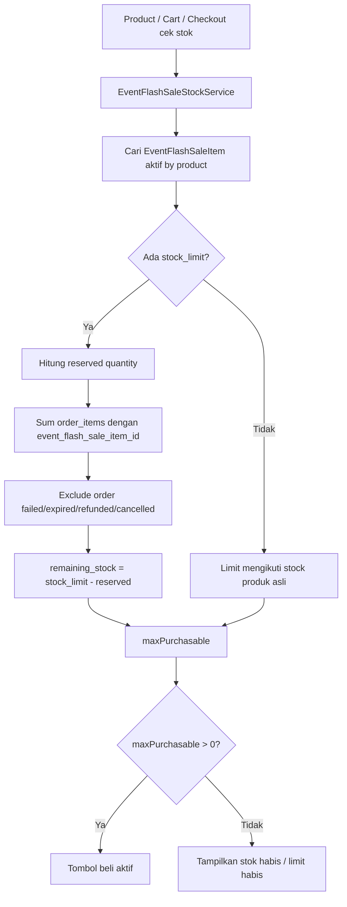

## 10. Flow Wishlist

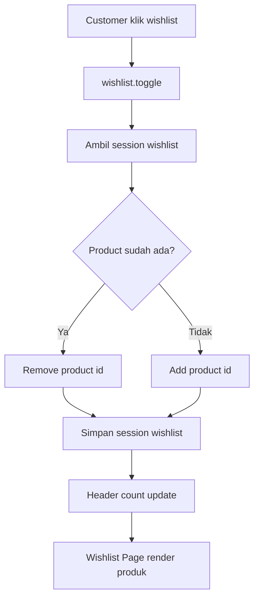

## 11. Flow Cart Produk dan Paket Kombo

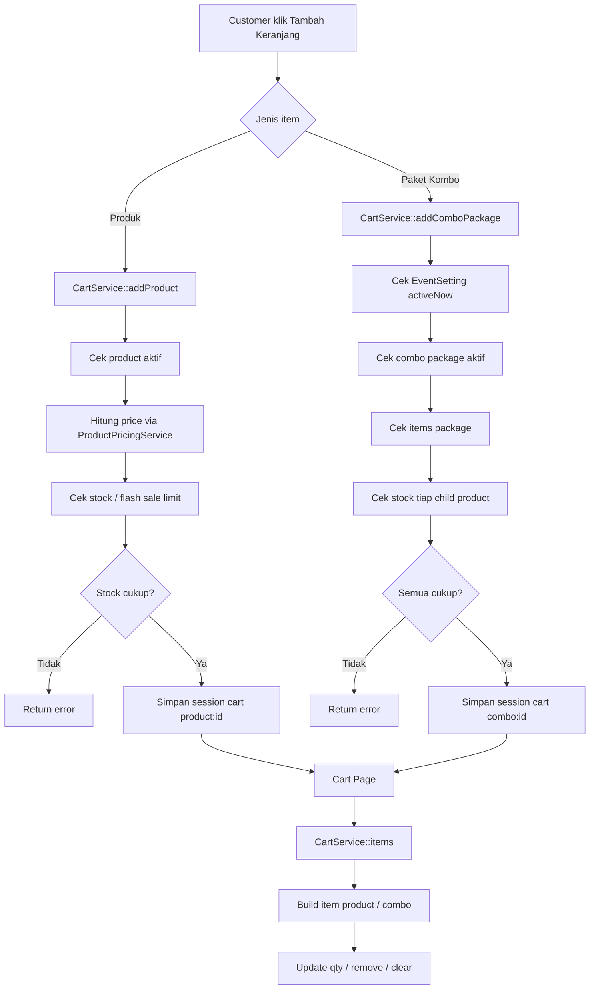

## 12. Flow Checkout sampai Order Created

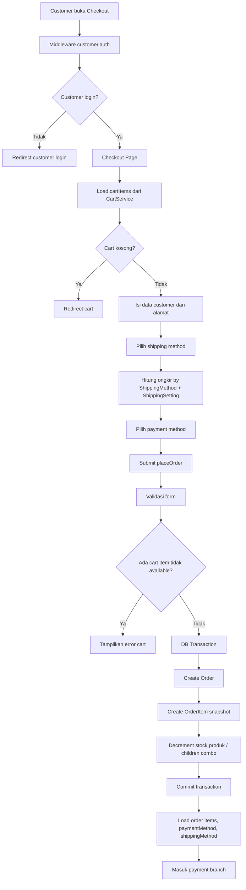

## 13. Flow Payment Branch: WhatsApp, Midtrans, Manual

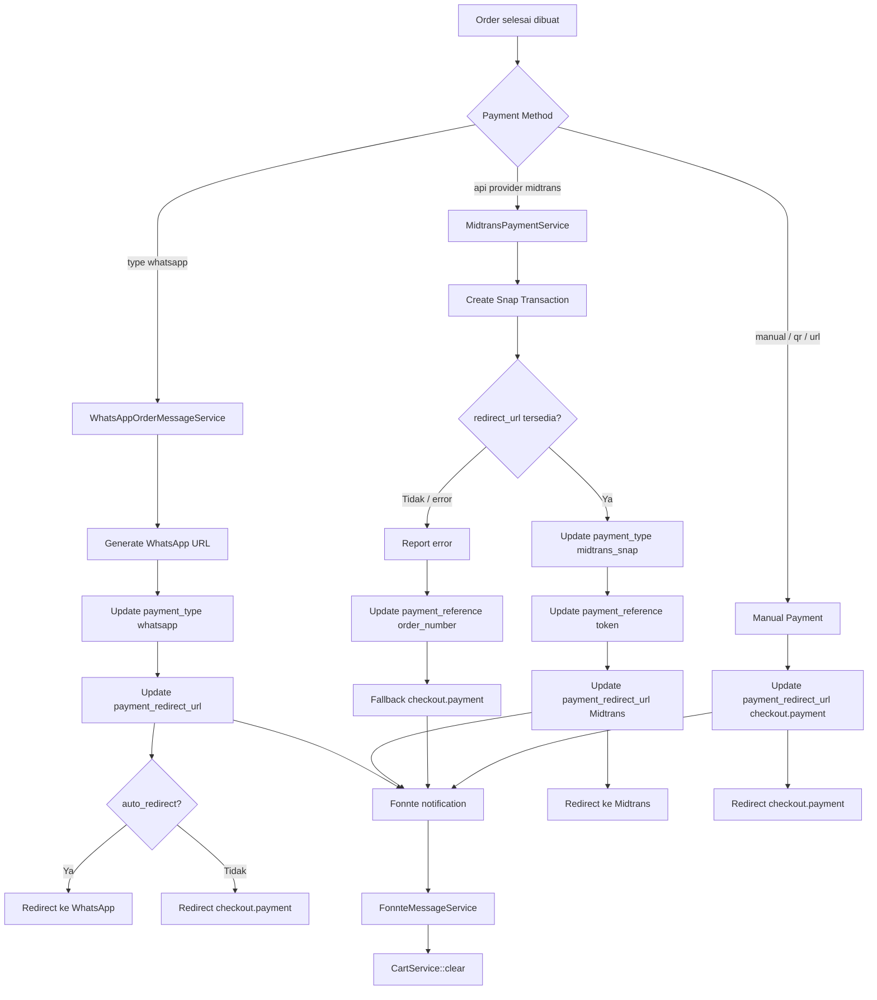

## 14. Flow Fonnte Notification

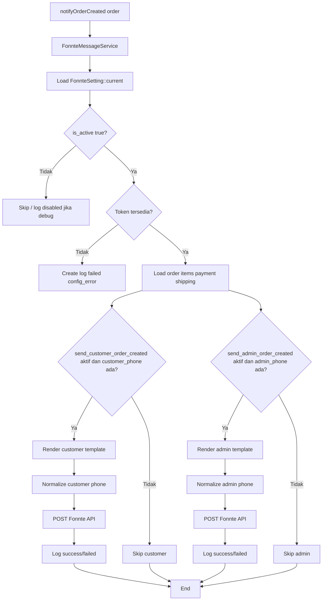

Catatan:
- Untuk localhost, error SSL cURL 60/77 berarti masalah CA certificate lokal, bukan flow Fonnte.
- Webhook Fonnte tidak wajib untuk kirim pesan keluar. Webhook dibutuhkan kalau ingin status pesan/incoming message masuk ke Laravel.
- Token lebih aman disimpan encrypted di database dan tidak ditampilkan ulang ke public property Livewire.

## 15. Flow Payment Page

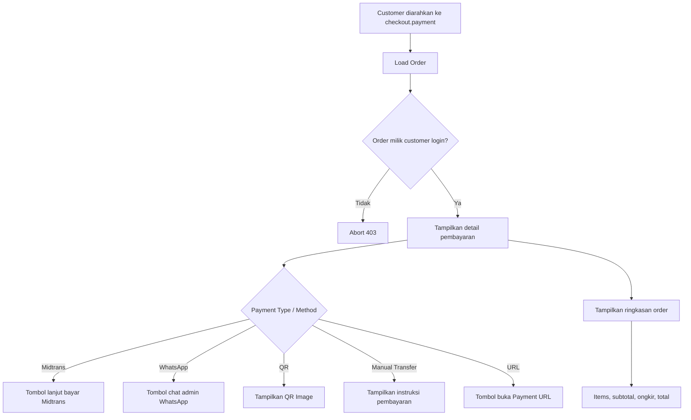

## 16. Flow Admin Orders dan Restore Stock

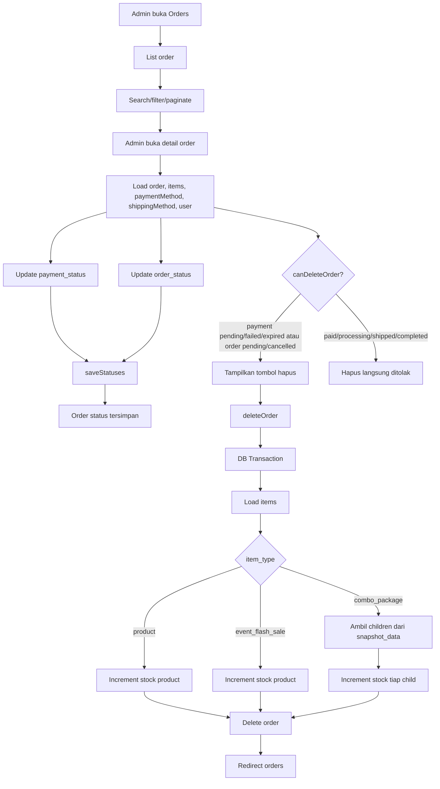

## 17. Flow Event Frontend

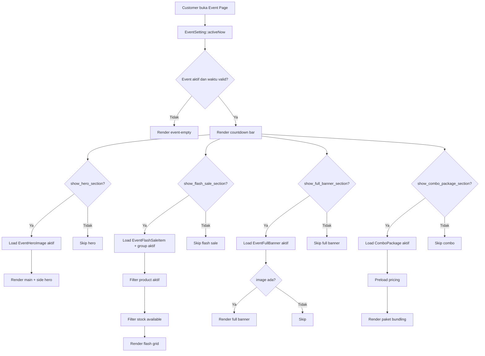

## 18. Flow Admin Event Management

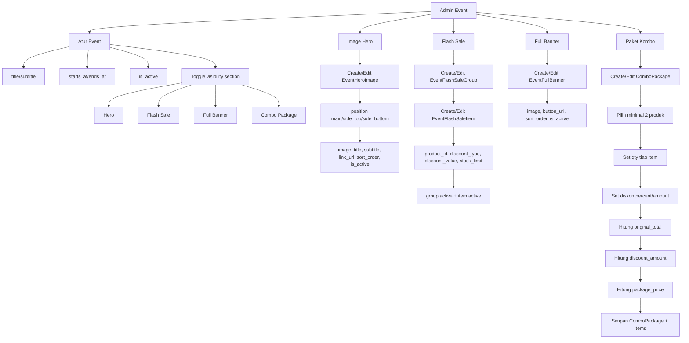

## 19. Flow Combo Package Detail dan Cart

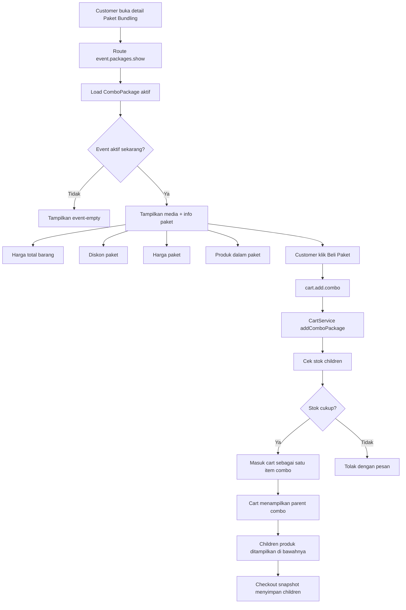

## 20. Flow Admin Dashboard Data

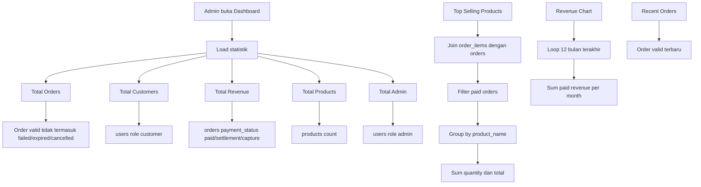

## 21. Flow Newsletter

```mermaid
flowchart TD
    A[Customer isi email newsletter di footer] --> B[POST newsletter.subscribe]
    B --> C[Validasi email]
    C --> D{Valid?}
    D -->|Tidak| E[Back dengan error]
    D -->|Ya| F[Normalize email lowercase]
    F --> G[NewsletterSubscriber::firstOrCreate]
    G --> H{Subscriber baru?}
    H -->|Ya| I[Simpan source footer, customer_id, ip, user_agent]
    I --> J[Flash success]
    H -->|Tidak| K[Flash info sudah terdaftar]

    L[Admin Customer > Newsletter] --> M[List subscriber]
    M --> N[Search]
    M --> O[Limit pagination]
```

## 22. Flow Database / ERD Ringkas

```mermaid
flowchart LR
    User[users] -->|has many| Order[orders]
    Order -->|has many| OrderItem[order_items]

    Category[categories] -->|has many| Product[products]
    Brand[brands] -->|has many| Product
    Product -->|has many| OrderItem

    PaymentMethod[payment_methods] -->|has many| Order
    ShippingMethod[shipping_methods] -->|has many| Order

    EventSetting[event_settings] --> EventRuntime[activeNow]
    EventRuntime --> EventHeroImage[event_hero_images]
    EventRuntime --> EventFlashSaleGroup[event_flash_sale_groups]
    EventFlashSaleGroup --> EventFlashSaleItem[event_flash_sale_items]
    EventFlashSaleItem --> Product

    ComboPackage[combo_packages] -->|has many| ComboPackageItem[combo_package_items]
    ComboPackageItem --> Product
    ComboPackage --> OrderItem

    HomeLayoutGroup[home_layout_groups] --> HomeLayoutSlot[home_layout_slots]
    HomeLayoutSlot --> Category
    HomeLayoutSlot --> HomeSection[home_sections]

    HomeCategoryGridSetting[home_category_grid_settings] --> HomeCategoryGridItem[home_category_grid_items]
    HomeCategoryGridItem --> Category

    FonnteSetting[fonnte_settings] --> FonnteMessageLog[fonnte_message_logs]
    FonnteMessageLog --> Order

    NewsletterSubscriber[newsletter_subscribers] --> User
```

## 23. Flow Migrations / Modul Database

```mermaid
flowchart TD
    A[Migrations] --> B[Core Laravel]
    A --> C[Catalog]
    A --> D[Shop Content]
    A --> E[Checkout]
    A --> F[Event]
    A --> G[Home Layout]
    A --> H[Customer]
    A --> I[Fonnte]

    B --> B1[users, cache, jobs]
    C --> C1[categories, brands, products]
    D --> D1[banners, home_sections, about_sections]
    E --> E1[orders, order_items]
    E --> E2[payment_methods, shipping_methods, shipping_settings]
    F --> F1[event_settings]
    F --> F2[event_hero_images]
    F --> F3[event_flash_sale_groups/items]
    F --> F4[event_full_banners]
    F --> F5[combo_packages/items]
    G --> G1[home_layout_groups]
    G --> G2[home_layout_slots]
    G --> G3[home_category_grid_settings/items]
    H --> H1[newsletter_subscribers]
    I --> I1[fonnte_settings]
    I --> I2[fonnte_message_logs]
```

## 24. Full Flow Pembelian dari Awal sampai Akhir

```mermaid
flowchart TD
    A[Customer masuk website] --> B[Lihat Home / Produk / Event]
    B --> C[Pilih produk atau paket]
    C --> D{Item type}

    D -->|Produk| E[Cek harga regular / promo / flash sale]
    D -->|Paket Combo| F[Cek event aktif dan paket aktif]

    E --> G[Cek stock / limit flash sale]
    F --> H[Cek stok semua produk paket]

    G --> I[Add to Cart]
    H --> I
    I --> J[Cart Session]
    J --> K[Cart Page]
    K --> L[Update qty / hapus / checkout]
    L --> M[Login customer jika perlu]

    M --> N[Checkout]
    N --> O[Isi data customer dan alamat]
    O --> P[Pilih shipping]
    P --> Q[Pilih payment]
    Q --> R[Place Order]

    R --> S[Validasi cart dan form]
    S --> T[Create Order]
    T --> U[Create OrderItem snapshot]
    U --> V[Kurangi stok]
    V --> W[Payment branch]

    W -->|WhatsApp| X[Generate WA URL]
    W -->|Midtrans| Y[Generate Snap URL]
    W -->|Manual/QR/URL| Z[Payment Page]

    X --> AA[Fonnte notif order created]
    Y --> AA
    Z --> AA

    AA --> AB[Clear cart]
    AB --> AC[Customer bayar / konfirmasi]
    AC --> AD[Admin cek order]
    AD --> AE[Admin update payment_status / order_status]
    AE --> AF[Order processing / shipped / completed]
```

## 25. Known Gaps / Hal yang Perlu Dicek Lagi

Bagian ini bukan error wajib, tapi daftar area yang perlu dipastikan supaya dokumentasi dan implementasi makin rapi.

1. Route Fonnte Settings. Layout admin sudah punya menu Fonnte Settings, jadi routes/web.php harus punya route admin.settings.fonnte.
2. Google customer callback. Pastikan login Google customer tidak menimpa akun admin menjadi role customer.
3. Midtrans webhook/status callback. Snap redirect sudah ada, tetapi status paid/expired/failed idealnya otomatis lewat webhook atau status checker.
4. Token Fonnte. Simpan encrypted di database, jangan tampilkan token lama di public property Livewire.
5. SSL localhost. Error cURL 60/77 di localhost diselesaikan dengan cacert.pem, bukan perubahan flow aplikasi.
6. Stock restore. Karena order langsung mengurangi stok saat dibuat, hapus order harus restore stok dari order_items snapshot.

```mermaid
flowchart TD
    A[Checklist Final] --> B[Route Fonnte ada]
    A --> C[Google login aman untuk admin]
    A --> D[Midtrans webhook/status checker]
    A --> E[Fonnte token encrypted]
    A --> F[SSL localhost fix]
    A --> G[Restore stock saat hapus order]

    B --> H[Flow production lebih stabil]
    C --> H
    D --> H
    E --> H
    F --> H
    G --> H
```
